# Recipe Assistant

## 아이디어 구현

### 필수 개선 아이디어

#### 1. 메인 페이지

- Material Drawer 외부 라이브러리를 사용하여 Navigation Drawer를 구현하였다. 메인페이지라는 Activity를 따로 두는 대신 Navigation을 사용하기로 결정하였다.
- Navigation을 구현하기 위해 외부 라이브러리인 MaterialDrawer를 사용하였으며 `MainActivity`에서 `DrawerBuilder()`를 통해 Navigation을 생성하는 것을 확인할 수 있으며 switch-case 문을 통해 각 fragment 또는 activity로 이동하는 것을 볼 수 있다.

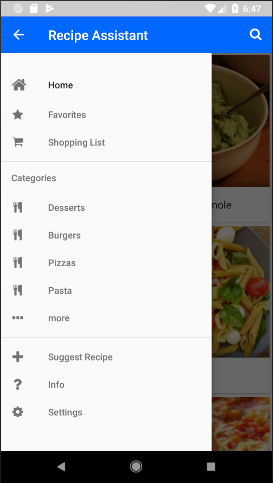

#### 2. 다양한 음식 메뉴 삽입

- 기존에 있던 Irish Stew와 Simple Guacamole 레시피 말고도 다양한 음식 레시피를 MySQL 데이터베이스를 통해 추가하였다. 또한, favorite과 viewed의 카운트를 테이블 열로 추가하였다.

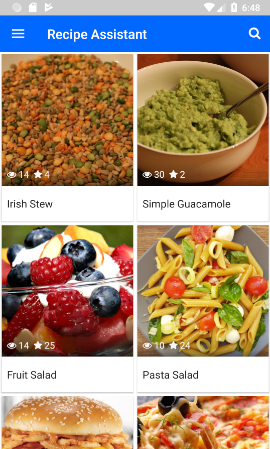

#### 3. 선호하는 음식 레시피 관리 기능

- 아래 사진의 별표 모양을 누르게 되면 별 아이콘이 빨간색으로 채워진다. `SingleRecipeActivity.class`에서는 `favproteBtn`으로 별 아이콘을 설정하였다. 이 때, 별 아이콘은 Android-Iconics라는 외부 라이브러리를 사용하였다.

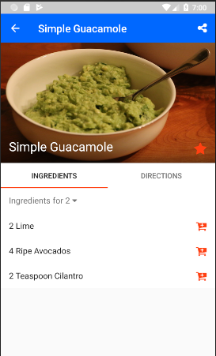

- Navigation을 통해 Favorites으로 이동하면 해당 Fragment에서 Favorite을 선택한 레시피를 볼 수 있다.
  - `FavoriteFragment.java` 를 통해 확인할 수 있다.

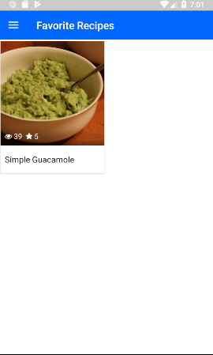

### 개선 아이디어

#### 1. 레시피 검색

- `HomeFragment.java`에서 `onCreateOptionsMenu()` 메소드를 통해서 구현 한 것을 확인할 수 있다.

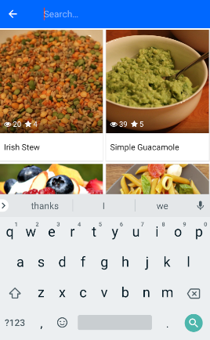

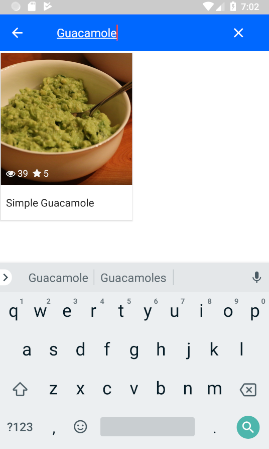

#### 2. 재료 쇼핑 리스트

- 아래 재료 리스트에서 쇼핑카트 아이콘을 누르게 되면 바로 쇼핑리스트에 재료가 추가된다.

`ShoppingListFragment.java` 의 `createServingsPicker()` 메소드와  `IngredientsFragment.java` 클래스에서 확인할 수 있다.

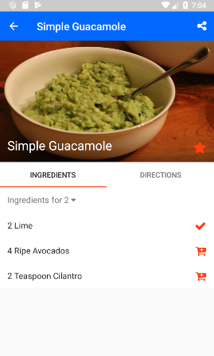

- ListViewAnimations 외부 라이브러리를 사용하여 위의 쇼핑리스트에서 왼쪽으로 swipe하면 삭제가 가능하도록 구현하였다.

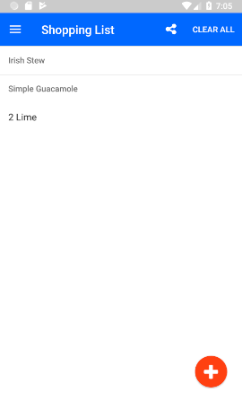

#### 3. 인원에 따른 재료량 변경

`ShoppingListFragment.java` 의 `setServings()` 메소드와 `Recipe.java` 클래스의 `calculateServings()` 메소드에서 확인할 수 있다.

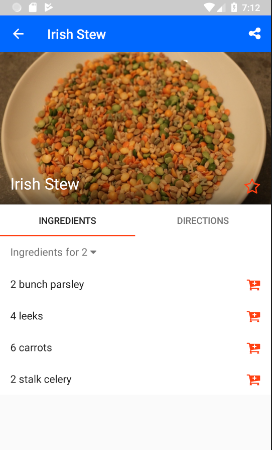

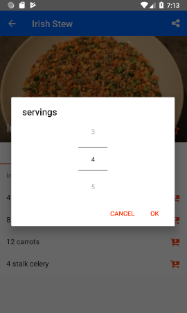

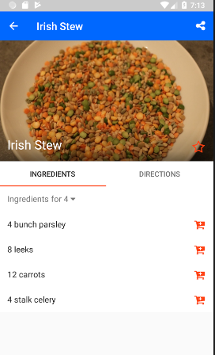

#### 4. 공유 기능

`SingleRecipeActivity.java`의 `onCreateOptionsMenu()`와 `onOptionsItemSelected()`의 메소드, 그리고 `Recipe.java`의 `share()` 메소드에서 확인할 수 있다.

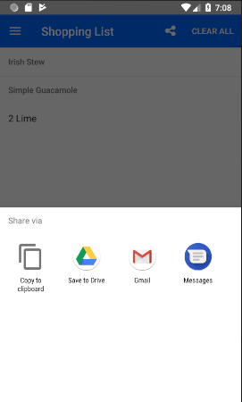

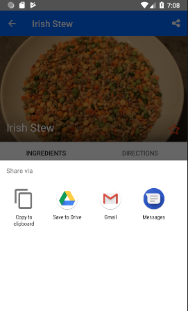

#### 5. 카테고리

`CategoriesFragment.java`와 `CategoryRecipesFragment.java`, `CategpruTextAndImageFragment.java` 클래스에서 확인할 수 있다.

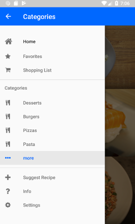

#### 6. 영양분 표시

`NutritionFragment.java` 클래스와 `SingleRecipeActivity.java`의 `setupViewPager()` 메소드에서 확인할 수 있다.

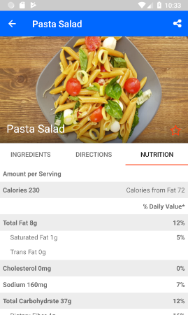

#### 7. Fragments간 swipe gesture로 이동

- 단일 레시피 화면에서 재료 fragment와 재료 fragment 간에 swipe 제스처로 이동
- `SingleRecipeActivity.java` 클래스에서 `recipeImage.setOnTouchListener()` 안에 오버라이딩된 `onSwipeLeft()` 와 `onSwipeRight()`의 메소드에서 확인할 수 있다.

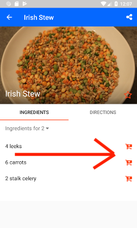

## 구현 방법

### CPanel

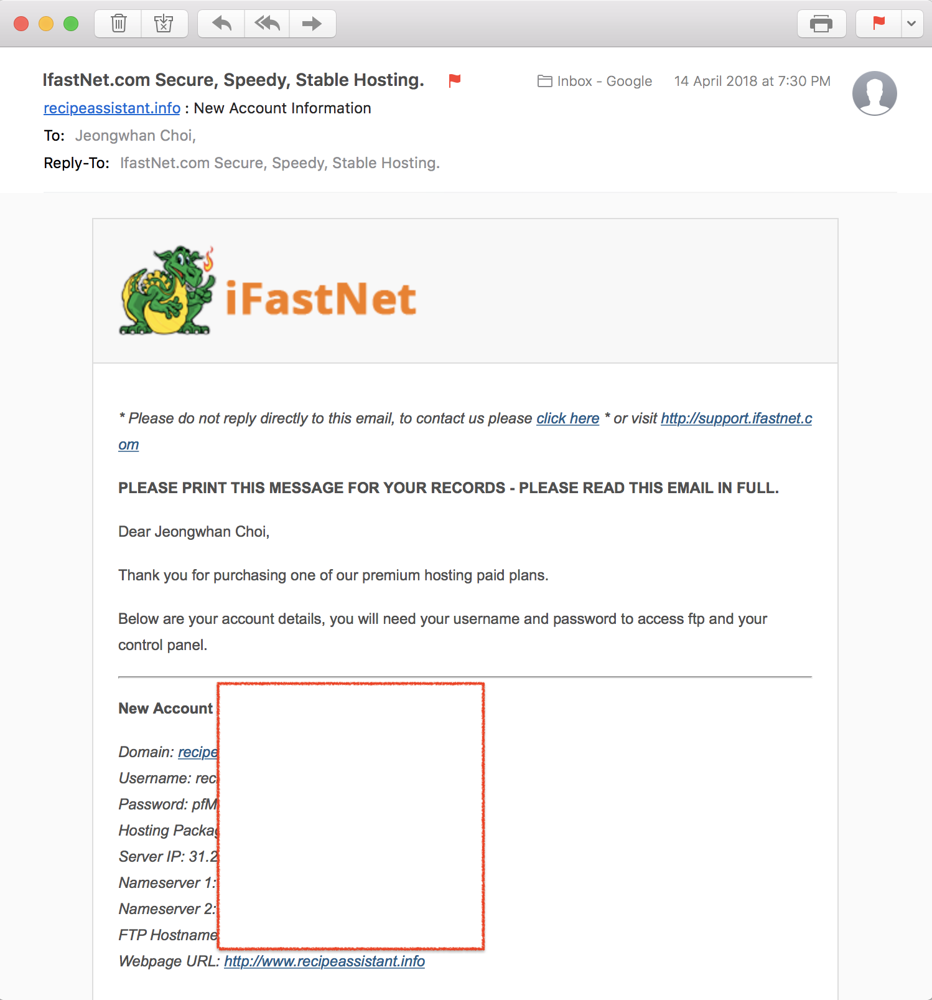

### cPanel 로그인

##### phpMyAdmin

MySQL에 다음과 같이 테이블을 만든다.

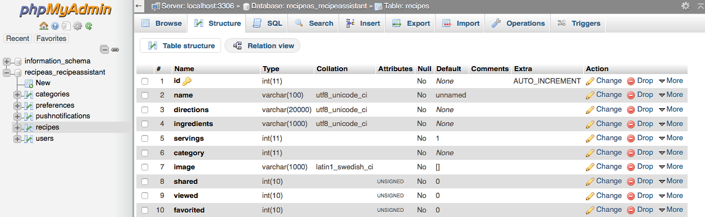

아래 캡처는 레시피 데이터들이 입력된 상태이다.

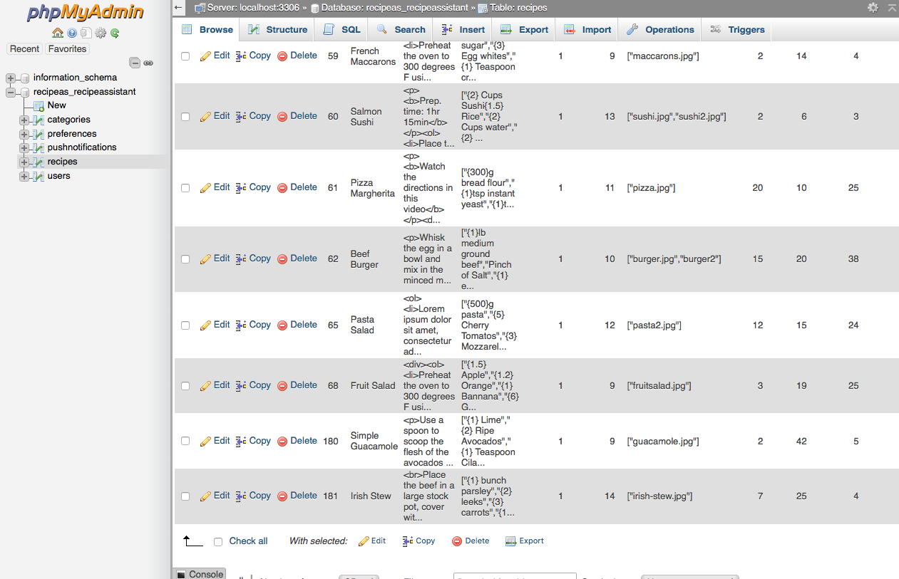

### PHP

##### FileZilla 이용하여 php파일 저장

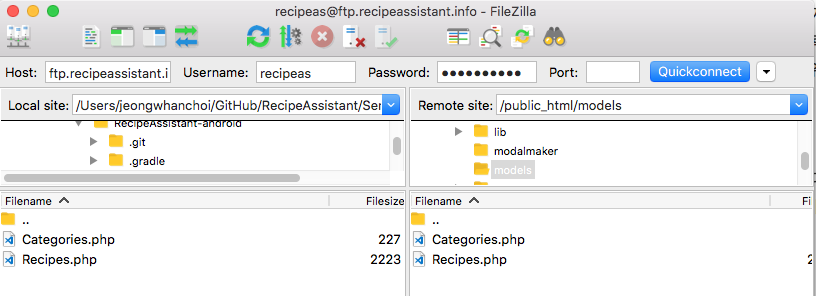

### Fragments

`Fragment`는  `Activity` 내에서 사용자 인터페이스의 일부를 나타낸다. 여러 개의 프래그먼트를 하나의 액티비티에 조합하여 창이 여러 UI를 구축할 수 있다.

- MainActivity
  - CategorieFragment
  - CategoryRecipesFragment
  - CategoryTextAndImageFragment
  - FavoriteFragment
  - HomeFragment
  - InfoFragment
  - ShoppingListFragment
- SingleRecipeActivity
  - DirectionsFragment
  - IngredientsFragment
  - NutritionFragment

### 외부 라이브러리 

#### [MaterialDrawer](https://github.com/mikepenz/MaterialDrawer)

- Navigation Drawer 라이브러리

- 사용 클래스

`MainActivity.java`

#### [Picasso](https://github.com/square/picasso)

- 이미지 다운로드&캐시 라이브러리

- 사용 클래스

`RecipeAdapter.java`

`CategoryAdapter.java`

`SingleRecipeActivity.java`

#### [Android-Iconics](https://github.com/mikepenz/Android-Iconics)

- 안드로이드 아이콘 라이브러리

- 사용 클래스

`RecipeAdapter.java`

`AddRecipeFragment.java`

`CategoryRecipesFragment.java`

`HomeFramgent.java`

`ShoppingListFragment.java`

`SingleRecipeActivity.java`

#### [FontAwesome](https://fontawesome.com)

- 폰트 라이브러리
- 사용 클래스

`CategoryRecipesFragment.java`

`HomeFramgent.java`

`ShoppingListFragment.java`

`MainActivity.java`

`SingleRecipeActivity.java`

#### [Volley](https://github.com/google/volley)

- 2013년 구글에서 발표한 안드로이드 HTTP 라이브러리
- 사용 클래스

`AddRecipeFragment.java`

`Category.java`

`LruBitmapCache.java`

`Preferemce.java`

`Recipe.java`

`VolleySingleton.java`

`VolleyMultipartRequest.java`

#### [PullZoomView](https://github.com/Frank-Zhu/PullZoomView)

- 스크롤 시 이미지가 확대되는 기능을 가진 라이브러리
- 사용 클래스

`SingleRecipeActivity.java`

#### [MaterialDesignLibrary](https://github.com/navasmdc/MaterialDesignLibrary)

- Material Design 라이브러리
  - 아래 Floating 버튼을 사용함

- 사용 클래스

`ShoppingListFragment.java`

#### [RichEditor-Android](https://github.com/wasabeef/richeditor-android)

- 안드로이드 에디터 라이브러리

- 사용 클래스

`AddRecipeFragment.java`

#### [ListViewAnimations](https://github.com/nhaarman/ListViewAnimations)

- ListView 항목에 애니메이션을 쉽게 추가 할 수있게 해주는 Android 라이브러리

- 사용 클래스

`ShoppingListAdapter.java`

`IngredientListAdapter.java`

`AddRecipeFragment.java`

`ShoppingListFragment.java`

## Reference

- cPanel MySQL Database(Using HTML to PHP to Database)
  - https://www.youtube.com/watch?v=rlsp7LGPSEc
  - https://www.youtube.com/watch?v=xx0YwP1O3Fs
- PHP와 MySQL의 연동 - 데이터를 HTML에 표현하기
  - https://opentutorials.org/course/62/5174
  - https://www.youtube.com/watch?v=AocaT966qaI
  - https://www.youtube.com/watch?v=ceiT46Lu8kE

- Gesture Swipe (OnSwipeTouchListner)
  - https://stackoverflow.com/questions/18591265/how-to-implement-a-swipe-gesture-between-fragments
  - https://stackoverflow.com/questions/18413309/how-to-implement-a-viewpager-with-different-fragments-layouts/18413437#18413437
  - https://developer.android.com/training/animation/screen-slide.html
- jeongwhanchoi_listview 외부 모듈
  - https://github.com/martinGele/Sandwich/tree/master/neurondigital_listview
- LruBitmapCache
  - https://gist.github.com/ficusk/5614325
- Cache
  - https://stackoverflow.com/questions/4546201/how-to-cache-save-custom-class-object-in-android
  - https://stackoverflow.com/questions/2353057/how-to-convert-inputstream-to-fileinputstream
- FontManager
  - https://stackoverflow.com/questions/44698220/how-to-add-awesome-font-icon-to-navigationview-icon-in-android
  - http://blog.incognitech.in/font-awesome-in-android/
- WebView
  - http://bcho.tistory.com/1051
  - https://developer.android.com/reference/android/webkit/WebView.html
  - https://stackoverflow.com/questions/5933934/need-help-for-android-webview
  - https://stackoverflow.com/questions/47890140/webview-setjavascriptenabled-and-javascript-on-site
- EndlessRecyclerViewScrollListener
  - https://github.com/ardok/codepath/blob/master/TwitterClient/app/src/main/java/com/codepath/twitterclient/listeners/EndlessRecyclerViewScrollListener.java
  - https://github.com/buosseph/soundcloud-android/blob/master/app/src/main/java/com/brianuosseph/soundcloudapp/EndlessRecyclerViewScrollListener.java
  - https://guides.codepath.com/android/Endless-Scrolling-with-AdapterViews-and-RecyclerView

